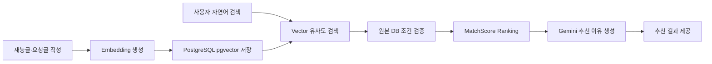

# Knotty

재능을 판매하는 사람과 필요한 일을 요청하는 사람을 연결하는 양방향 재능 거래 플랫폼입니다.  
재능글과 요청글을 탐색하고 채팅에서 거래를 시작하며, 자연어 기반 AI 매칭으로 조건에 맞는 게시글을 추천받을 수 있습니다.

## 주요 기능

| 영역 | 기능 |
| --- | --- |
| 회원 | 이메일 로그인, Google OAuth2, HttpOnly Cookie 기반 JWT 인증 |
| 재능글 | 작성·조회·수정·비활성화, 이미지 및 대표 이미지, 포트폴리오 연결 |
| 요청글 | 작성·조회·수정·마감, 이미지 및 대표 이미지 |
| 포트폴리오 | 사용자별 포트폴리오 CRUD와 파일 관리 |
| 채팅 | WebSocket/STOMP 기반 실시간 메시지와 거래 요청 메시지 |
| 거래 | 금액 제안, 결제, 정산, 취소·환불, 지갑 내역 |
| AI 생성 | Gemini를 이용한 재능글·요청글 초안 생성 |
| AI 매칭 | pgvector 유사도 검색, SQL 조건 검증, 서버 Ranking, 추천 이유 생성 |

리뷰 및 사용자 평판 기능은 일정과 MVP 범위 조정에 따라 현재 구현 대상에서 제외했습니다.

## 서비스 흐름



거래 방식은 게시글 유형에 따라 다릅니다.

- **재능글:** 작성자가 판매 금액을 설정하고 신청자가 결제합니다. 글은 거래 후에도 유지할 수 있습니다.
- **요청글:** 작성자가 상대방에게 금액 설정을 요청하고, 상대방의 제안 금액을 작성자가 결제합니다. 결제가 시작되면 1회성 요청글은 진행 상태로 전환됩니다.

## 기술 스택

### Backend

- Java 17, Spring Boot 4.0.7, Gradle
- Spring MVC, Spring Data JPA, Spring Security, OAuth2 Client
- Spring WebSocket, STOMP, SockJS
- PostgreSQL, pgvector, Redis
- Spring AI 2.0.1, Google Gemini
- JWT, Springdoc OpenAPI

### Frontend

- HTML, CSS, Vanilla JavaScript
- Express 정적 서버 및 API Proxy
- DOMPurify
- STOMP.js, SockJS Client
- Node.js Test Runner, JSDOM

## 프로젝트 구조

```text
.
├── backend/                 # Spring Boot API 서버
│   └── src/main/java/org/example/link/
│       ├── ai/              # 생성, 임베딩, 매칭
│       ├── auth/            # JWT, OAuth2, Cookie, CSRF
│       ├── common/          # 공통 응답과 예외 처리
│       └── domain/          # 게시글, 채팅, 거래, 지갑 등
├── frontend/                # Vanilla JS 웹 클라이언트
│   ├── src/api/             # API 호출 모듈
│   └── src/features/        # 기능별 화면과 로직
└── docs/                    # 명세, ADR, 개발 가이드, 트러블슈팅
```

## 로컬 실행

### 1. 사전 준비

- Java 17
- Node.js 18 이상
- PostgreSQL과 pgvector 확장
- Redis
- Google Gemini API Key
- 이미지 업로드를 사용할 경우 Supabase Storage 설정

PostgreSQL 대상 데이터베이스에서 pgvector 확장을 활성화합니다.

```sql
CREATE EXTENSION IF NOT EXISTS vector;
```

신규 로컬 DB를 직접 구성할 때는 [초기 스키마](./docs/schema.sql)를 참고합니다. 기존 DB에는 테이블 삭제 없이 필요한 마이그레이션만 적용해야 합니다.

기존 `vector_store.id`가 `UUID`로 생성된 환경은 Spring AI의 `{TARGET_TYPE}:{UUID}` Document ID를 저장할 수 없습니다. 이 경우 [VectorStore ID 마이그레이션](./docs/migrations/20260831_vector_store_id_to_text.sql)을 한 번 적용합니다.

### 2. 환경변수 설정

```bash
cd backend
cp .env.sample .env
```

`backend/.env`에 다음 값을 설정합니다.

```dotenv
DB_HOST=localhost
DB_NAME=
DB_USERNAME=
DB_PASSWORD=

JWT_SECRET=
FRONTEND_ORIGIN=http://localhost:3000
AUTH_COOKIE_SECURE=false
AUTH_COOKIE_SAME_SITE=Lax

REDIS_HOST=
REDIS_PORT=
REDIS_USERNAME=
REDIS_PASSWORD=

GOOGLE_CLIENT_ID=
GOOGLE_CLIENT_SECRET=

SUPABASE_URL=
SUPABASE_SERVICE_KEY=
SUPABASE_BUCKET=

GEMINI_API_KEY=
AI_PGVECTOR_INITIALIZE_SCHEMA=true
```

실제 비밀값이 들어 있는 `.env` 파일은 Git에 커밋하지 않습니다. 운영 HTTPS 환경에서는 `AUTH_COOKIE_SECURE=true`와 서비스 환경에 맞는 `SameSite` 정책을 사용해야 합니다.

### 3. 백엔드 실행

```bash
cd backend
./gradlew bootRun
```

- API: `http://localhost:8080`
- Swagger UI: `http://localhost:8080/swagger-ui/index.html`

### 4. 프론트엔드 실행

프로젝트 최상위가 아니라 `frontend` 디렉터리에서 실행합니다.

```bash
cd frontend
npm install
npm start
```

- Web: `http://localhost:3000`
- `/api` 요청은 기본적으로 `http://localhost:8080`으로 프록시됩니다.

백엔드 주소를 변경하려면 다음과 같이 실행합니다.

```bash
API_TARGET=http://localhost:8081 npm start
```

## 테스트

```bash
cd backend
./gradlew test
```

```bash
cd frontend
npm test
```

백엔드 테스트는 실행 후 전체 성공·실패·건너뜀 개수를 요약해서 출력합니다. 프론트엔드 테스트는 CSRF 요청 처리와 XSS 방어를 포함합니다.

## 설계 핵심

- Access Token과 Refresh Token은 JavaScript에서 읽을 수 없는 HttpOnly Cookie로 관리합니다.
- Cookie 인증의 CSRF 위험은 SameSite·Secure 정책과 CSRF Token 검증으로 방어합니다.
- 사용자 입력과 Markdown 출력은 DOMPurify 기반으로 정화해 XSS 위험을 줄입니다.
- 결제·정산·환불 시 거래, 지갑, 1회성 요청글 행에 비관적 락을 적용합니다.
- 거래 중복 처리는 서비스 검증과 DB 제약을 함께 사용합니다.
- AI 매칭은 VectorStore metadata를 원본 데이터로 신뢰하지 않고, 후보 UUID로 도메인 데이터를 다시 일괄 조회합니다.
- 최종 순위는 서버의 MatchScore가 결정하며 LLM은 추천 이유 생성에 사용합니다.
- 임베딩 처리는 원본 CRUD 트랜잭션 커밋 이후 실행해 AI 장애가 게시글 저장을 롤백하지 않게 합니다.

## 문서

- [문서 전체 안내](./docs/README.md)
- [프로젝트 기획서](./docs/기획서.md)
- [요구사항 명세서](./docs/requirements.md)
- [API 명세서](./docs/api.md)
- [ERD](./docs/erd.md)
- [Render 배포 점검 가이드](./docs/deployment-render.md)
- [코딩 및 PR 컨벤션](./docs/CONVENTION.md)
- [AI 기능 개발 가이드](./docs/ai/AI-기능-개발-가이드.md)
- [ADR 목록](./docs/README.md#adr)
- [트러블슈팅 목록](./docs/README.md#트러블슈팅)

## 현재 후속 과제

- Render 운영 배포에서 `/ai/matches` 공개 접근 설정 재검증
- 공개 AI API 호출 제한 적용
- 임베딩 전체 재생성 및 장애 복구 수단 마련
- 대규모 데이터에서 metadata 선필터 및 후보 누락 개선
- 운영 환경의 HTTPS, Cookie, CORS 정책 검증
