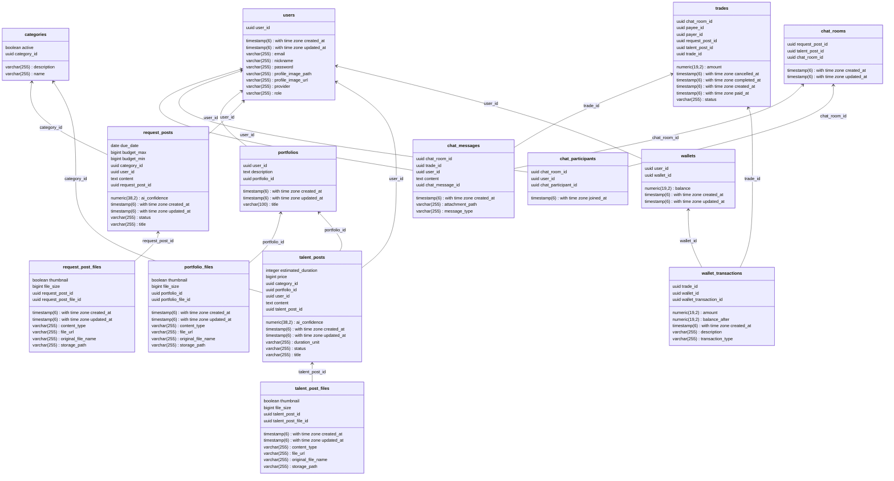

```mermaid
classDiagram
direction BT
class categories {
   boolean active
   varchar(255) description
   varchar(255) name
   uuid category_id
}
class chat_messages {
   timestamp(6) with time zone created_at
   uuid chat_room_id
   uuid trade_id
   uuid user_id
   varchar(255) attachment_path
   text content
   varchar(255) message_type
   uuid chat_message_id
}
class chat_participants {
   timestamp(6) with time zone joined_at
   uuid chat_room_id
   uuid user_id
   uuid chat_participant_id
}
class chat_rooms {
   timestamp(6) with time zone created_at
   timestamp(6) with time zone updated_at
   uuid request_post_id
   uuid talent_post_id
   uuid chat_room_id
}
class portfolio_files {
   boolean thumbnail
   timestamp(6) with time zone created_at
   bigint file_size
   timestamp(6) with time zone updated_at
   uuid portfolio_id
   varchar(255) content_type
   varchar(255) file_url
   varchar(255) original_file_name
   varchar(255) storage_path
   uuid portfolio_file_id
}
class portfolios {
   timestamp(6) with time zone created_at
   timestamp(6) with time zone updated_at
   uuid user_id
   varchar(100) title
   text description
   uuid portfolio_id
}
class request_post_files {
   boolean thumbnail
   timestamp(6) with time zone created_at
   bigint file_size
   timestamp(6) with time zone updated_at
   uuid request_post_id
   varchar(255) content_type
   varchar(255) file_url
   varchar(255) original_file_name
   varchar(255) storage_path
   uuid request_post_file_id
}
class request_posts {
   numeric(38,2) ai_confidence
   date due_date
   bigint budget_max
   bigint budget_min
   timestamp(6) with time zone created_at
   timestamp(6) with time zone updated_at
   uuid category_id
   uuid user_id
   text content
   varchar(255) status
   varchar(255) title
   uuid request_post_id
}
class talent_post_files {
   boolean thumbnail
   timestamp(6) with time zone created_at
   bigint file_size
   timestamp(6) with time zone updated_at
   uuid talent_post_id
   varchar(255) content_type
   varchar(255) file_url
   varchar(255) original_file_name
   varchar(255) storage_path
   uuid talent_post_file_id
}
class talent_posts {
   numeric(38,2) ai_confidence
   integer estimated_duration
   timestamp(6) with time zone created_at
   bigint price
   timestamp(6) with time zone updated_at
   uuid category_id
   uuid portfolio_id
   uuid user_id
   text content
   varchar(255) duration_unit
   varchar(255) status
   varchar(255) title
   uuid talent_post_id
}
class trades {
   numeric(19,2) amount
   timestamp(6) with time zone cancelled_at
   timestamp(6) with time zone completed_at
   timestamp(6) with time zone created_at
   timestamp(6) with time zone paid_at
   uuid chat_room_id
   uuid payee_id
   uuid payer_id
   uuid request_post_id
   uuid talent_post_id
   varchar(255) status
   uuid trade_id
}
class users {
   timestamp(6) with time zone created_at
   timestamp(6) with time zone updated_at
   varchar(255) email
   varchar(255) nickname
   varchar(255) password
   varchar(255) profile_image_path
   varchar(255) profile_image_url
   varchar(255) provider
   varchar(255) role
   uuid user_id
}
class wallet_transactions {
   numeric(19,2) amount
   numeric(19,2) balance_after
   timestamp(6) with time zone created_at
   uuid trade_id
   uuid wallet_id
   varchar(255) description
   varchar(255) transaction_type
   uuid wallet_transaction_id
}
class wallets {
   numeric(19,2) balance
   timestamp(6) with time zone created_at
   timestamp(6) with time zone updated_at
   uuid user_id
   uuid wallet_id
}

chat_messages  -->  chat_rooms : chat_room_id
chat_messages  -->  trades : trade_id
chat_messages  -->  users : user_id
chat_participants  -->  chat_rooms : chat_room_id
chat_participants  -->  users : user_id
portfolio_files  -->  portfolios : portfolio_id
portfolios  -->  users : user_id
request_post_files  -->  request_posts : request_post_id
request_posts  -->  categories : category_id
request_posts  -->  users : user_id
talent_post_files  -->  talent_posts : talent_post_id
talent_posts  -->  categories : category_id
talent_posts  -->  portfolios : portfolio_id
talent_posts  -->  users : user_id
wallet_transactions  -->  trades : trade_id
wallet_transactions  -->  wallets : wallet_id
wallets  -->  users : user_id

```